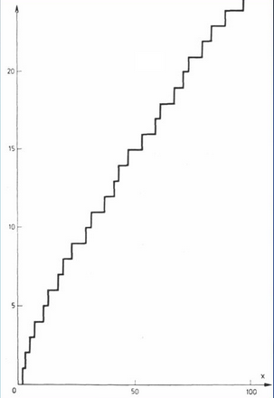
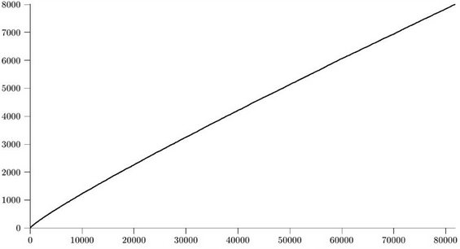
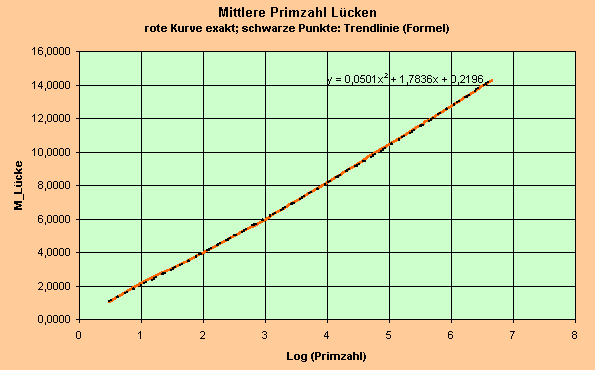

# Primzahllücken

In diesem Praktikum beschäftigen wir uns mit Primzahlen und den Lücken zwischen Ihnen.
Im Bereich von 0 bis 100 kann man es sich ncoh am besten vorstellen, aber auf dem ersten Bild ist nochmal ein Graph
abgebildet, der die Verteilung der Primzahlen illustriert. Wie man sieht verläuft der Graph ungefähr linear.
Es sind zwar einige Aussreißer dabei, aber die fallen im ganzen nicht ins Gewicht.

Auf diesem Bild sieht man, dass sich dieses Verhalten auch für große Zahlen fortsetzt.

Hier ist das selbe nochmal illustriert, nur dass die Aussreißer hier auch geplottet wurden.
Wie man sieht scheint sich der Abstand zwischen den Primzahlen linear zu verhalten.

Dass er nicht nicht immer gleich ist bzw. eine Schranke schwer festzulegen ist liegt daran, dass
die Primzahlen nicht uniform verteilt sind, sodass durch nahe beieinander liegende Primzahlen auch wiederrum
größere Lücken entstehen. Wenn man nun eine Zahl zufällig zieht, ist die Wahrscheinlichkeit größer eine Zahl aus
solch einer Lücke zu ziehen, als eine Zahl zwischen 2 nah beeinander Primzahlen zu ziehen.
