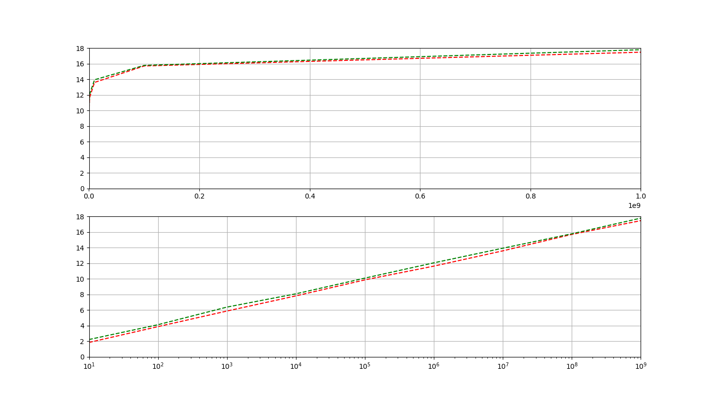

# Euklidischer Algorithmus

## Laufzeit und Stellenanzahl

Da die Aufgabe lautete, wir sollen einen funktionalen Zusammenhang vermuten, habe
ich einfach die Werte mit Hilfe von matplotlib gezeichnet.

Die erste Grafik zeigt den Funktionsverlauf mit linear skalierter x-Achse,
die zweite mit logarithmisch skalierter x-Achse.
Die x-Achse stellt in beiden Fällen die Größe der Zahl dar, die y-Achse die
Anzahl der der Schritte des euklidischen Algorithmus.
Beim grünen Graphen habe ich immer den ggT von Zahlen mit gleicher
Stellenanzahl berechnet.
Beim roten habe ich immer Zahlen zwischen 0 und dem jeweiligen x-Wert.

In der ersten Grafik, in der die Anzahl der Schritte im Bezug auf
die numerische Größe der Zahlen dargestellt ist, sieht man
einen logarithmischen Verlauf.
Durch die lineare Darstellung der x-Achse sind in dieser Grafik x-Werte
mit __Exponent 7__ noch in der Nähe der 0 angezeigt.

Dadurch, dass bei der zweiten Grafik eine logarithmische Skalierung
vorgenommen wurde, wird hier der Zusammenhang mit der Stellen Anzahl betrachtet.
1 Stelle = 10^1.
Anscheinend scheint die Schrittzahl proportional von der Stellen Anzahl
der Zahlen abzuhängen.
Dieser Zusammenhang lässt sich einfach ablesen: 2x, wobei x die
Anzahl der Stellen ist.
